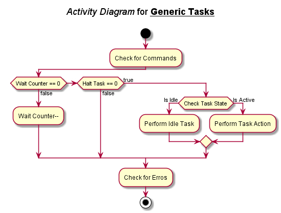

# OTP15_oVario
### Branch: `VSCode`

# Open Issues:
- :white_check_mark: Implement proper task behaviour in *sdio task*. 
- :white_check_mark: Make *scheduler* interrupt-based.
- :black_square_button: Adjust timing of *scheduler*.
- :black_square_button: Improve **IPC** for *I2C* communication.
- :white_check_mark: Register and get every **IPC** item sperately.
- :black_square_button: Make the assignment of the loop rates in the *scheduler* more modular with `#define LOOP_RATE`.

# Documentation
**Content:**

- [Main Structure](#main-structure) 
    - [ini-File](#ini-file)
- [Scheduler](#scheduler)
- [Arbiter](#arbiter)
    - [Command Structure](#command-structure)
    - [Task Structure](#task-structure)
- [Inter Process Communication](#inter-process-communication---ipc)
    - [IPC Initialization Procedure](#ipc-initialization-procedure)
    - [IPC Messaging Procedure](#ipc-messaging-procedure)
    - [IPC Register Overview](#ipc-register-overview)
- [Error Handling](#error-handling)
    - [**Error Codes**](#error-codes)

## Main Structure

### ini-File

## Scheduler

## Arbiter

The arbiter is used to manage the commands within one task **<ins>without</ins>** blocking of the main function. Every command is divided into **sequences** to achieve this behaviour. The command performs its action until it needs to wait for another task or command to finish. Only when the "wait" is over it goes to the next sequence.

A task is one source file. </br>
**For Example:** Everything within `i2c.c` is part of the **i2c-task**. 

### Command Structure

Here you can see the basic command structure to be used with the arbiter:


In the beginning of the command you can get the arguments of the command and allocate memory. These steps are optional, but if you use them they have to be called outside of the `switch-case` which follows. Either of these functions return a pointer which points to the desired value. </br> 
**Important:** *Arguments* and *allocated memory* can only be accessed via dereferencing the pointer!

The current sequence of the command is selected by a `switch-case` structure. The **first** sequence of the structure **<ins>must always</ins>** be the symbol `SEQUENCE_ENTRY`. This sequence is defined within the arbiter library and is the *default* sequence when entering a new command. Accordingly, the last sequence of the command **<ins>must always</ins>** be the symbol `SEQUENCE_FINISHED`. It is used within the arbiter to manage commands which are waiting for this command.

In between the command can have as many sequences as needed. Be aware that the symbol `SEQUENCE_FINISHED` is defined as **255**. So the maximum number of custom sequences is **254**. :information_desk_person: Although you could restart the numbering of the sequences for every command in each task, I recommend to use unique sequence numbers within one task to be able to reuse sequences in different commands.

#### Calling Commands
There are two ways to call other commands within one command:

- Call-by-Reference: Call a function and only give **one** pointer as argument
- Call-by-Value: Call a function and give **multiple** arguments as values

You can call other commands within one command. You can call the *calling-function* multiple times. Upon the first call, it activates the desired command. When returning to the initial command, the *calling-function* does not invoke the function again, but returns 0 or 1, when the desired command was successful or not.

Every command also returns a **return-value**, which can be accessed by the calling command.

The call type of every command is specified in the **comment header** of the command. It tells you the type and number of arguments and defines the **return-value**. Here you can see an example header:
```c
/***********************************************************
 * Set the state of a cluster, writing the FAT.
 ***********************************************************
 *  
 * Argument[0]:	unsigned long	l_cluster
 * Argument[1]:	unsigned long	l_state
 * Argument[2]: unsigned long*	l_databuffer
 * Return:		none
 * 
 * call-by-value, nargs = 3
 ***********************************************************/
```
The command has 3 arguments. *Argument[2]* is a pointer, to be more precise it is the **actual address** of where the pointer is pointing to. It gets a bit tricky when passing pointers via call-by-value, but it is managable. :wink:

#### Setting Arguments

There is a global argument pointer `unsigned long* args` defined within each task to call functions. Here you can see how the example command is called by other commands:
```c
//Allocate and set the arguments of the called command
args = arbiter_allocate_arguments(&task_sdio, 3);
args[0] = *l_current_cluster;
args[1] = *l_state_cluster;
args[2] = (unsigned long)filehandler->buffer;

//Call the set cluster command
if (arbiter_callbyvalue(&task_sdio, SDIO_CMD_SET_CLUSTER))
{
    //Do something when SET_CLUSTER is finished.
}
```
First you have to allocate the number of arguments the called command needs. *Argument[0]* and *Argument[1]* are the values of the local variables/pointers. *Argument[2]* is a reference/pointer and its **absolute Address** is passed as an `unsigned long` variable. (Otherwise the compiler complains, because it implicitely casts the address value...)

#### Getting Arguments

When a command reads its arguments, it gets the starting pointer of its argument stack. The command <ins>**must**</ins> to know by itself how many arguments it requires! Here is the example how the example command reads its arguments:
```c
//Get input arguments
unsigned long *l_cluster    = arbiter_get_argument(&task_sdio);						  //Argument[0]
unsigned long *l_state      = l_cluster + 1;										  //Argument[1]
unsigned long *l_databuffer = (unsigned long *) arbiter_get_reference(&task_sdio, 2); //Argument[2]
```

- `Argument[0]`: 
    
    Here the pointer just gets the starting address of the argument stack. Its value can be accessed via dereferencing the pointer.

- `Argument[1]`:

    The next argument in the argument stack is the **starting address + 1**. You could call the arbiter function again, or just use the already existing pointer.

- `Argument[2]`:

    This argument is a reference/pointer which was passed via *call-by-value*. To make things a bit easier, there is a function within the arbiter, which returns a `void` pointer to the desired argument. this pointer then has to be casted to the desired pointer type.

When the function is called by *call-by-reference*, you simply use the pointer which is returned by the *get-argument* function.

### Task Structure

The structure of a generic task can be seen here:



- First, the task checks the **IPC** command queue for new commands. Depending on the behaviour of the task - interruptable or non-interruptable - it only checks for finished signals or additionally sets the active command.
- After the **IPC** is checked, the task checks whether a commands wants to wait s specific number of task calls. When the counter is **not** 0, the wait is **not** over and the wait counter is **decreased**. The wait is over when the counter reaches 0. This means the task can only wait for multiple number of the **loop time** of the task.
- When no wait is ongoing, the task checks, whether it waits for any other tasks to finish. Here the principle of *semaphores* is used. When a command calls another task it adds the **dID** of the target task to `Halt Task`. As long as `Halt Task` is **not** 0, the task is waiting for another task. When the other task is finished, it signals via **IPC** that it is finished. The halted task checks the **IPC** queue for this signal and subtracts the **dID** of the received signal from `Halt Task`. Only when every called task is finished, `Halt Task` is 0 and the task itself can execute.
- When the task executes, the arbiter checks which command is active and performs the command actions. Every task **<ins>must always</ins>** have a idle command defined by `CMD_IDLE`. This is the *default state* of the arbiter when **no** command is active. For **non-interruptable** tasks, only the idle command sets the new active commands received by **IPC**.
- After the sequence of the active command is finished, the task can check for errors and set the state or active command accordingly.


## Inter Process Communication - IPC

### IPC Initialization Procedure

### IPC Messaging Procedure

### IPC Register Overview

The follwing tables give an overview of which memory and queues are registered for **IPC**.
Memory items additionally have the information where they are called by **IPC**.

#### Registered Memory

Memory which is registered but not used in other tasks is crossed out.
|dID|Type|Registered in|Referenced by|
|---|---|---|---|
|did_SYS|`SYS_T`|*oVario_Framework.c*|*sdio.c* <br/> *gps.c*|
|did_MS5611|`ms5611_T`|*ms5611.c*|*datafusion.c* <br/> *gui.c*|
|~~did_LCD~~|~~`uint32_t`~~|~~*DOGXL240.c*~~||
|did_DATAFUSION|`datafusion_T`|*datafusion.c*|*gui.c* <br/> *vario.c* <br/> *igc.c*|
|did_BMS|`BMS_T`|*bms.c*|*oVario_Framework.h* <br/> *gui.c*|
|did_GPS_DMA|`uint32_t`|*gps.c*||
|did_GPS|`GPS_T`|*gps.c*|*datafusion.c* <br/> *gui.c* <br/> *igc.c*|
|did_SDIO|`SDIO_T`|*sdio.c*|*oVario_Framework.h* <br/> *gui.c* <br/> *igc.c*|
|~~did_DIRFILE~~|~~`FILE_T`~~|~~*sdio.c*~~|  |
|did_FILEHANDLER|`FILE_T`|*sdio.c*| *igc.c* (Pointer address is called once...) |

#### Registered Queues

|dID|Elements|Type|Registered in|
|---|:---:|---|---|
|did_SOUND|5|`T_command`| *sound.c*|
|did_BMS|20|`T_command` | *bms.c*|
|did_SDIO|5|`T_command` | *sdio.c*|
|did_GUI|20|`T_command` | *gui.c*|
|did_VARIO|20|`T_command`| *vario.c*|
|did_IGC|5|`T_command`| *igc.c*|
|did_MD5|5|`T_command`|*md5.c*|
|did_I2C|10|`T_command`|*i2c.c*|
|did_MS5611|5|`T_command`|*ms5611.c*|

## Timing
### Task Overview
|Task|Selftime|Loop Rate|
|---|:---:|:---:|
|sdio_task|50 µs|1 ms|
|ms5611_task|10 µs|100 ms|

### Task Specification
#### *ms5611_task()*
|Command|Called Commands| Self Sequences | Total Sequences|
|---|---|:---:|:---:|
|ms5611_init()|-|10|10|
|ms5611.idle()|ms5611_get_pressure()|2|9|
|ms5611_get_temperature()|-|3|3|
|ms5611_get_pressure()|ms5611_get_temperature()|4|7|


## List of Interrupts
|Interrupt Vector|Task|Priority|
|---|---|:---:|
|Systick_Handler|*main.c*|0|
|SDIO_IRQHandler|*sdio.c*|0|
|EXTI0_IRQHandler|*exti.c*|0|
|EXTI1_IRQHandler|*exti.c*|0|
|EXTI2_IRQHandler|*exti.c*|0|
|EXTI3_IRQHandler|*exti.c*|0|
|DMA1_Stream1_IRQHandler|*gps.c*|0|
|TIM3_IRQHandler|*sound.c*|0|
|I2C1_EV_IRQHandler|*i2c.c*|0|
|DMA1_Stream6_IRQHandler|*i2c.c*|0|
|DMA1_Stream5_IRQHandler|*i2c.c*|0|

## Used DMA Streams & Channels
|DMA#|Stream|Channel|Peripheral|Priority|File|
|---|:---:|:---:|:---|:---:|---|
|DMA2|6|4|**SDIO**|xxx|*sdio.c*|
|DMA1|4|0|**SPI2_TX**|xxx|*DOGXL240.c*|
|DMA1|1|4|**USART3_RX**|xxx|*gps.c*|
|DMA1|6|1|**I2C1_TX**|xxx|*i2c.c*|
|DMA1|5|1|**I2C1_RX**|xxx|*i2c.c*|

## Error Handling

### Error Codes


